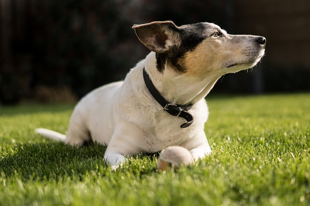
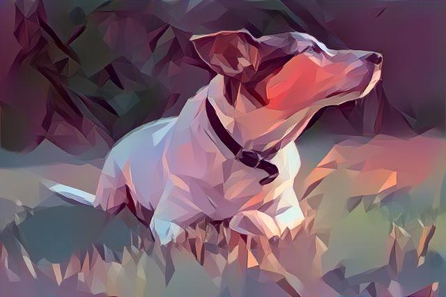

# neural-style-transfer
This repository contains an implementation of the work presented in the paper 
 [A Neural Algorithm of Artistic Style](https://arxiv.org/abs/1508.06576) by *Leon A. Gatys, Alexander S. Ecker, 
 Matthias Bethge*. Based on a style and content image, a new target image is created, which contains the content of the 
 content image and the style of the style image. The content and style information are extracted from 
 convolutional layers of a VGG-19 model trained on ImageNet.

## Installation
The easiest way to get the provided code running is by creating a python environment based on the provided 
`environment.yml` file.

```sh
$ conda env create -f environment.yml
```

This creates a conda environment called `neural-style-transfer`, which shall be activated prior to use of the command 
line tool.

```sh
$ conda activate neural-style-transfer
```

If the conda environment already exists, it can be activated with the following command.

```
$ conda env update -f environment.yml
```

## Usage
```sh
Usage: neural-style-transfer.py [OPTIONS] STYLE_IMAGE CONTENT_IMAGE
                                TARGET_IMAGE

Options:
  --epochs INTEGER  Number of epochs
  --alpha INTEGER   Content weight
  --beta FLOAT      Style weight
  --help            Show this message and exit
```

## Examples
The following example was created with `--epochs 5000`.

| Style   | Content | Result|
| ------- | ------| ----- |
|||

## License
neural-style-transfer is Copyright © 2019 Alexander Stante. It is free software, and may be redistributed under the 
terms specified in the [LICENSE](/LICENSE) file.